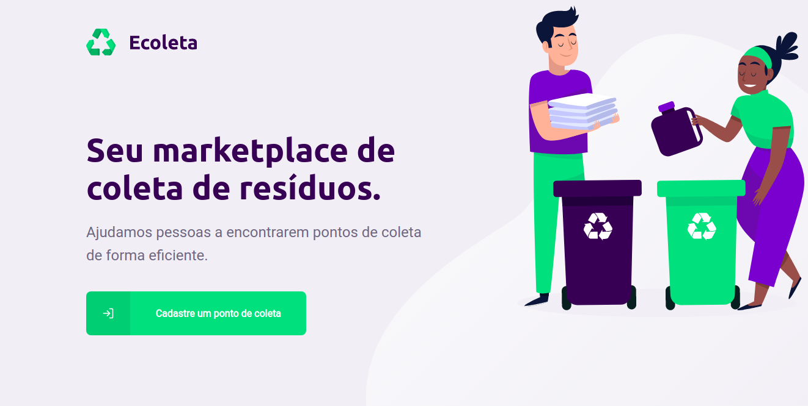
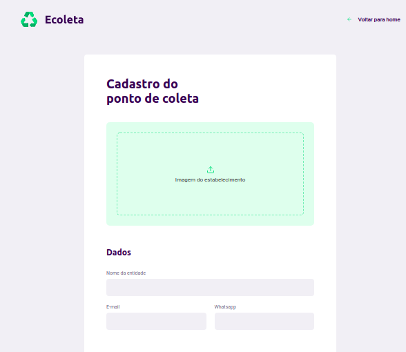
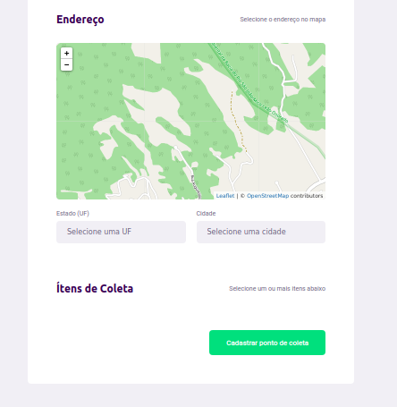
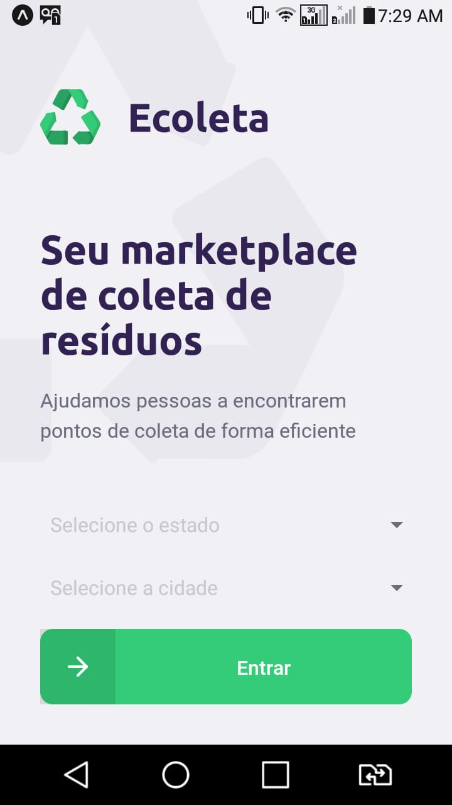
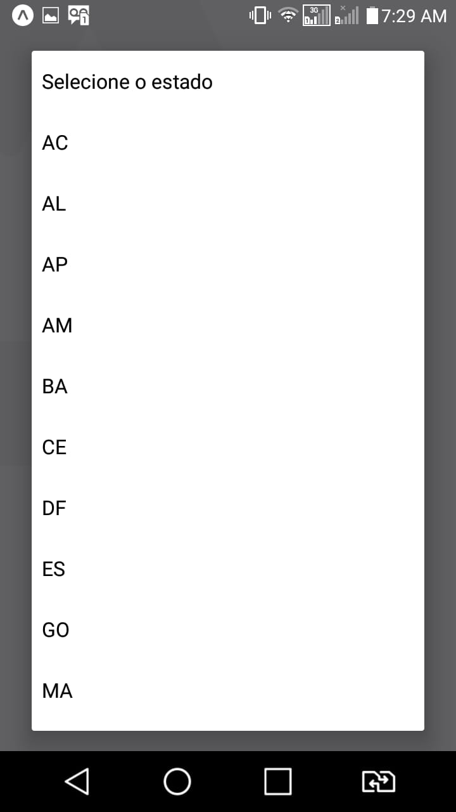
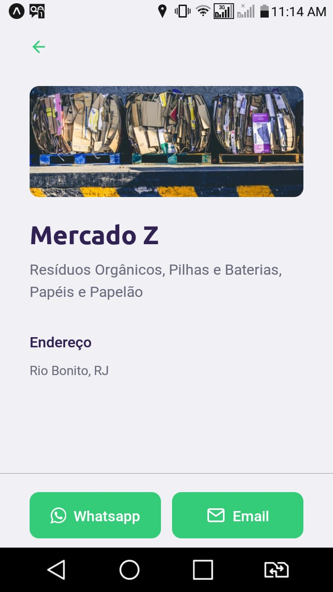
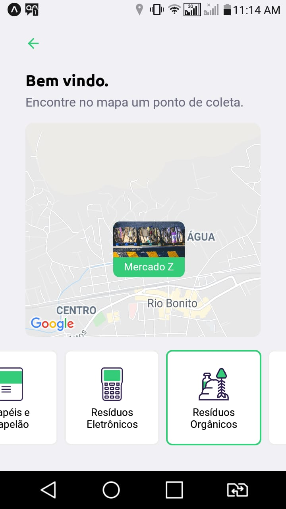

# Ecoleta

O Projeto ***Ecoleta*** foi desenvolvido durante a Next Level Week da Rocketseat e visa integrar o público com pontos de coletas de materiais recicláveis.

## Backend -- <a href="./backend/">Server<a/>

O servidor foi construído na arquitetura REST, em Typescript, utilizando Express e SQLite para gerar a API a ser utilizada pelo website e pelo aplicativo mobile.

## Frontend -- <a href="./web/">Web<a/>

Consiste numa página de cadastro dos pontos de coleta. Foi desenvolvido em Typescript, utilizando React.

 

## Aplicativo Mobile -- <a href="./mobile/">Mobile<a/>

Possibilita ao usuário consultar pontos cadastrados filtrados por estado, cidade e tipo de recicláveis coletados. Também desenvolvido em Typescript, com React Native e utilizando o Expo.

   
